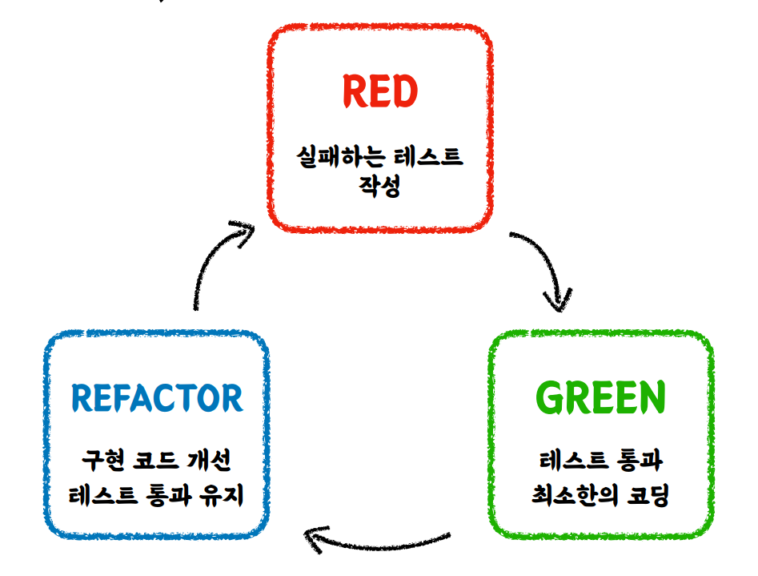

# TIL--TestCode

## 목차
### 1. [테스트 코드는 왜 필요한가? (2023-05-21)](#테스트-코드는-왜-필요한가)
### 2. [수동 테스트 VS 자동화된 테스트 (2023-05-23)](#수동-테스트-vs-자동화-된-테스트)
### 3. [테스트 케이스 세분화 하기 (2023-05-23)](#테스트-케이스-세분화-하기)
### 4. [테스트하기 어려운 영역을 분리하기 (2023-05-24)](#테스트하기-어려운-영역을-분리하기)
### 5. [TDD란 (2023-04-29)](#TDD란)

<br>
<br>
<br>
<br>
<br>

<br>
<br>
<br>
<br>
<br>
<br>
<br>

## 테스트 코드는 왜 필요한가

<br>

### 테스트 코드를 작성하지 않는다면

- 변화가 생기는 매 순간마다 발생할 수 있는 모든 Case를 고려해야 한다.
- 변화가 생기는 매 순간마다 모든 팀원이 동일한 고민을 해야 한다.
- 빠르게 변화하는 소프트웨어의 안정성을 보장할 수 없다.

<br>

### 테스트 코드가 병목이 된다면

- 프로덕션 코드의 안정성을 제공하기 힘들어진다.
- 테스트 코드 자체가 유지보수하기 어려운, 새로운 짐이 된다.
- 잘못된 검증이 이루어질 가능성이 생긴다.

<br>
<br>
<br>
<br>
<br>
<br>
<br>
<br>

## 수동 테스트 vs 자동화 된 테스트
<br>

### [수동 테스트 코드](https://github.com/kimyubi/TIL--TestCode/commit/f5de1cac26584d62a8e5d45d627d52ce2907c6df)
과연 이 코드가 자동화를 한 테스트인가?

이렇게 콘솔에 출력하여 테스트를 한다면, 결국 최종 확인 주체는 결국 `사람`이다.  
<br>


⇒ 콘솔에 출력된 내용을 보고, 코드가 잘 동작하는지 확인해야 함.  
⇒ 따라서, 다른 사람이 이 테스트 코드를 봤을 때 무엇을 검증해야 하는지 알 수 없다.  
⇒ 현재 테스트 코드는 검증 없이 콘솔에 출력만 하기 때문에 무조건 성공할 수 밖에 없는
테스트 코드이기 때문이다.  

<br>
<br>

### 단위 테스트(Unit test)

 학습 목표

- 사람이 최종적으로 확인해야 하는 수동 테스트와, 기계가 직접 검증해주는 자동화 된 테스트에
  대한 차이를 인지한다.
- 단위 테스트, 통합 테스트, 인수 테스트와 같은 자동화된 테스트 기법 중, 가장 기본이 되는
  **단위 테스트**에 대해 이해하고, 적용한다.
  
  [수동화 테스트 코드 => 단위 테스트](https://github.com/kimyubi/TIL--TestCode/commit/36a481f20aed795f80ec53aa21c1a6405a0167ba)

<br>
<br>

 #### 단위 테스트란

- 클래스 혹은 메서드와 같이, **작은** 코드 단위를 **독립적**으로 검증하는 테스트
- 외부에 의존하지 않기 때문에 검증 속도가 빠르고, 안정적이다.

<br>

#### 단위 테스트를 위한 도구


**JUnit 5**

- 단위 테스트를 위한 프레임워크

<br>

**AssertJ**

- 테스트 코드 작성을 원활하게 돕는 테스트 라이브러리
- 개발자가 테스트를 하면서 필요하다고 상상할 수 있는 거의 모든 메소드를 제공한다.
- 메서드 체이닝을 지원하기 때문에 좀 더 깔끔하고 읽기 쉬운 테스트 코드를 작성할 수 있다.  
<br> 
(* 메서드 체이닝: 여러 메서드 호출을 연결해 하나의 실행문으로 표현하는 문법 형태)
<br>


spring-boot-starter-test 의존성에 JUnit5와 AssertJ, Mockito 등이 포함되어 있다.

<br>
<br>
<br>
<br>
<br>
<br>
<br>
<br>

## 테스트 케이스 세분화 하기

⇒ 경계값 테스트를 활용한다. [(경계값 테스트 예시)](https://github.com/kimyubi/TIL--TestCode/commit/d84afd7bcd7c7085eaf95cc57cebdeaf926069cd)

1. 질문하기

   ⇒ 암묵적이거나, 아직 드러나지 않은 요구사항이 있는가?  

<br>

3. 테스트 케이스 세분화 하기

   ✔ **해피 케이스**  
   요구사항을 그대로 만족하는 케이스
   
   <br>

   ✔ **예외 케이스**  
   요구사항에 드러나지 않은 암묵적인 케이스

<br>
<br>

   해피 케이스와 예외 케이스를 테스트하기 위해서는 <span style="color:orange">경계값 테스트 </span>가 중요하다  
    * 경계값 테스트 : 범위(이상, 이하, 초과, 미만), 구간, 날짜 등

   ⇒ 변수 x가 3 이상일때 A라는 조건을 만족해야 한다고 가정했을 때,  
   경계값 3에 대한 테스트를 짜는 것이 경계값 테스트
    
 <br>
 <br>

    
    
   ### 해피 케이스 검증하기
   
   ```
   ⇒ 변수 x의 값을 경계값(3)으로 설정하여 테스트  
   ⇒ 경계값보다 큰 값(5)로 설정할 경우, 5에 대해서는 만족하는데, 3에 대해서는 만족하지 않는 경우가 생길 수 있기 때문이다.  
   ```
   
   <br>
   
   ### 예외 케이스 검증하기
   
   ```
   ⇒ 변수 x의 값을 경계값과 가까운 수(2)로 설정하여 테스트  
   ⇒ 경계값과 먼 수로 설정하여 테스트하는 것은 큰 효용성이 없기 때문이다.  
   ```

<br>
<br>
<br>
<br>
<br>
<br>
<br>
<br>
<br>
<br>

## 테스트하기 어려운 영역을 분리하기

<br>
<br>

학습 목표 :

- 테스트 할 때마다 <span style="color:orange"> 다른 값에 의존하는 코드 </span> 를 구분하고, 분리하는 방법을 익힌다.
- 실행 시점에 따라 테스트의 결과가 달라지는 코드에서, 실행 시점에 의존하지 않는 코드로 변경한다.
- 실행 시점을 특정하여, 실행 시점에 따라 해피 케이스와 예외 케이스를 분리하고,
  경계값 테스트를 통해 로직을 검증하는 테스트 코드를 작성한다.

<br>
<br>

---
<br>


## 테스트 하기 어려운 코드/ 쉬운 코드

### `테스트 하기 어려운 코드란`

<br>

1.  **테스트 할 때마다 <span style="color:orange; font-weight:bold"> 다른 값에 의존하는 </span> 코드**

즉, 외부 세계에서 들어오는 값이 테스트 대상에 의존하는 경우를 말한다.  

( Ex: 현재 날짜 / 시간, 랜덤 값, 전역 변수/함수, 사용자 입력 등)  

<br>

2. **외부 세계에 <span style="color:orange; font-weight:bold">  영향을 주는 </span> 코드**

테스트 대상이 외부 세계에 영향을 주고, 따라서, 그것에 의존에 있는 코드

(Ex: 표준 출력, 메시지 발송, 데이터베이스 조작 등)

<br>

### **`테스트 하기 쉬운 코드란`**
<br>

테스트 하기 쉬운 코드란 <span style="color:green; font-weight:bold"> 같은 입력에 항상 같은 결과를 반환 </span> 하는 코드이다.  

즉, 외부 세계와 단절된 형태

<br>
<br>
<br>

좋은 테스트 코드를 작성하기 위해서는 테스트 하기 어려운 코드와 쉬운 코드를 구분하고,
분리할 수 있어야 한다.

<br>
<br>

---
<br>


## 테스트 하기 쉬운 코드 연습

<br>
<br>

### 📌 실행 시점이 다르다고, 테스트에 실패하지 않기  

<br>


다음 코드는
주문 요청이 들어온 시간이 주문 가능한 시간인 경우, Order 객체를 생성하여 반환하고,
그렇지 않은 경우, 예외를 던지는 기능을 제공하는 코드이다.

```java
@Getter
public class CafeKiosk {

	private static final LocalTime SHOP_OPEN_TIME = LocalTime.of(10,0);
	private static final LocalTime SHOP_CLOSE_TIME = LocalTime.of(22,0);

	private final List<Beverage> beverageList = new LinkedList<>();

	public void addBeverage(Beverage beverage, int count) {
			 ...
		}
	}

	public void addBeverage(Beverage beverage) {
		...
	}

	public void removeBeverage(Beverage beverage){
		...
	}

	public Order createOrder(){
		LocalDateTime now = LocalDateTime.now();
		LocalTime currentTime = now.toLocalTime();

		if (currentTime.isBefore(SHOP_OPEN_TIME) || currentTime.isAfter(SHOP_OPEN_TIME)) {
			throw new IllegalArgumentException("주문 시간이 아닙니다. 관리자에게 문의하세요.");
		}

		return new Order(now, beverageList);
	}
}
```


<br>
<br>

이 기능의 검증을 위한 테스트 코드는 다음과 같다.

```java
@Test
	@DisplayName("테스트하기 어려운 영역을 분리하기 전의 테스트 코드")
	void createOrder(){
		CafeKiosk cafeKiosk = new CafeKiosk();
		Americano americano = new Americano();
		cafeKiosk.addBeverage(americano);

		Order order = cafeKiosk.createOrder();

		assertThat(order.getBeverageList()).hasSize(1);
		assertThat(order.getBeverageList().get(0).getName()).isEqualTo("아메리카노");
	}
```

<br>
<br>
이 테스트 코드는 실행 시점에 따라, 테스트 결과가 달라지는 코드이다.

<br>

주문 가능한 시간인 오전 10시와 오후 10시 사이에 테스트를 실행하면 테스트에 성공하지만,

이외의 시간에 테스트를 실행하면 `createOrder()` 메서드는 예외를 던지므로 테스트에 실패한다.

<br>
<br>

즉, `createOrder()` 메서드는 테스트 하기 어려운 코드이다.

따라서, `createOrder()` 메서드에서 테스트 하기 어려운 영역을 구분하고, 분리하여

테스트 하기 쉬운 코드로 설계를 변경하는 것이 중요하다.

<br>
<br>

지금의 `createOrder()` 메서드는 메서드 내부에서 현재 시간을 받아 처리하고 있다.

테스트를 어렵게 만드는 영역(메서드 내부에서 LocalDateTime.now()를 통해 현재 시간을 받는 영역)
을 구분했으니, 이 영역을 분리하기 위해 현재 시간을 함수 외부에서 받도록 `createOrder()` 메서드를 재 설계 해보자.

<br>
<br>

테스트 하기 어려운 영역을 분리한 `createOrder()` 메서드는 다음과 같다.

```java

	public Order createOrder(LocalDateTime now){
		LocalTime currentTime = now.toLocalTime();
		if (currentTime.isBefore(SHOP_OPEN_TIME) || currentTime.isAfter(SHOP_OPEN_TIME)) {
			throw new IllegalArgumentException("주문 시간이 아닙니다. 관리자에게 문의하세요.");
		}

		return new Order(now, beverageList);
	}
```

<br>
<br>

이 기능의 검증을 위한 테스트 코드는 다음과 같다.

```java
@Test
	@DisplayName("테스트하기 어려운 영역을 분리한 후의 테스트 코드 (해피 케이스)")
	void createOrderInTimeWithCurrentTime(){
		CafeKiosk cafeKiosk = new CafeKiosk();
		Americano americano = new Americano();
		cafeKiosk.addBeverage(americano);

		Order order = cafeKiosk.createOrder(LocalDateTime.of(2023,05,24,10,0));

		assertThat(order.getBeverageList()).hasSize(1);
		assertThat(order.getBeverageList().get(0).getName()).isEqualTo("아메리카노");
	}

	@Test
	@DisplayName("테스트하기 어려운 영역을 분리한 후의 테스트 코드 (예외 케이스)")
	void createOrderOutTimeWithCurrentTime(){
		CafeKiosk cafeKiosk = new CafeKiosk();
		Americano americano = new Americano();
		cafeKiosk.addBeverage(americano);

		assertThatThrownBy(() -> cafeKiosk.createOrder(LocalDateTime.of(2023,05,24,22,1)))
			.isInstanceOf(IllegalArgumentException.class)
			.hasMessage("주문 시간이 아닙니다. 관리자에게 문의하세요.");
	}
```

<br>
<br>

재 설계한 `createOrder()` 메서드는 실행 시점에 의존하고 있지 않기 때문에,  
실행 시점에 따라 해피 케이스와 예외 케이스를 분리하고, 경계값 테스트를 통해  
임의의 시간이 주어졌을 때 내가 짠 코드가 의도한대로 동작하는지 검증하는 것이 가능해졌다!  

<br>
<br>

테스트 과정에 있어서는 현재 테스트를 실행하고 있는 시간이 중요한 것이 아니라,  
임의의 시간이 주어졌을 때, 내가 작성한 로직이 정상적으로 동작하는지 검증하는 것이 중요하다.


<br>
<br>

따라서, 테스트 코드 상에서 외부에서 들어오는 값에 의존하지 않고,  
해피 케이스 / 예외 케이스에 따라 원하는 값을 넣어 테스트할 수 있도록 설계를 변경하는 것이 중요하다.


<br>
<span style="background-color:#fff5b1"> 😊 테스트 하기 어려운 영역을 외부로 분리할 수록 테스트 가능한 코드는 많아진다. </span>

<br>
<br>
<br>
<br>
<br>
<br>
<br>
# [0529] TDD란

## ✅ TDD  : Test Driven Development

- 프로덕션 코드보다 테스트 코드를 먼저 작성하여 **테스트가 구현 과정을 주도**하도록 하는 방법론


<br>

---
<br>
<br>
<br>




- **RED** : 실패하는 테스트 코드를 먼저 작성한다.<br>


- **GREEN**: 테스트 코드를 성공시키기 위한 프로덕션 코드를 작성한다.
  (테스트를 통과하기 위한 최소한의 코딩으로)  <br>


- **REFACTOR :** 테스트 통과를 유지하며, 구현 코드를 개선한다.

---

## TDD 실습

1. [[TDD 1단계] RED : 실패하는 테스트 코드 먼저 작성한다.](https://github.com/kimyubi/TIL--TestCode/commit/5ca71c9bde5eee247ac25f2124db58bc26fee27f)  <br>


2. [[TDD 2단계] GREEN : 테스트를 통과하기 위한 최소한의 코딩으로 테스트 코드를 성공시키기 위한 프로덕션 코드를 작성한다.](https://github.com/kimyubi/TIL--TestCode/commit/5597e26e0687f2ad5226b58f57564e9fe6c44699)   <br>


3. [[TDD 3단계] REFACTORING : 테스트 통과를 유지하며(초록 불을 유지하며), 구현 코드를 개선한다.](https://github.com/kimyubi/TIL--TestCode/commit/2be753d47ee9ae7721e0a5985e1578a3e4849756)


4. [[TDD 3단계] REFACTORING : 기능을 보장하는 테스트 코드가 있으므로, 테스트 통과를 유지하며 과감한 리팩토링을 시도해볼 수 있다.](https://github.com/kimyubi/TIL--TestCode/commit/5a75f4c37bb7df1cf207643168697b5cf51da74a)

---
<br>
<br>

## TDD의 핵심 가치


<br>

### 💡 **피드백**

<br>
<br>

**(선)** 기능 구현,   **(후)** 테스트 작성 방식의 단점

- 테스트 자체의 누락 가능성이 생긴다.
- 특정 테스트 케이스( → 해피 케이스)만 검증할 가능성이 있다.
- 잘못된 구현을 다소 늦게 발견할 가능성이 있다.

<br>
<br>

**(선)** 테스트 작성,   **(후)** 기능 구현 방식의 장점

- 복잡도가 낮은, 테스트 가능한 코드로 프로덕션 코드를 작성할 수 있게 한다.
- 쉽게 발견하기 어려운 엣지 케이스를 놓치지 않도록 해준다.
- 구현에 대한 빠른 피드백을 받을 수 있다.
- 과감한 리팩토링이 가능해진다.

<br>
<br>


### TDD란 ⇒  **클라이언트 관점에서의** 피드백**을 주는 Test Driven**